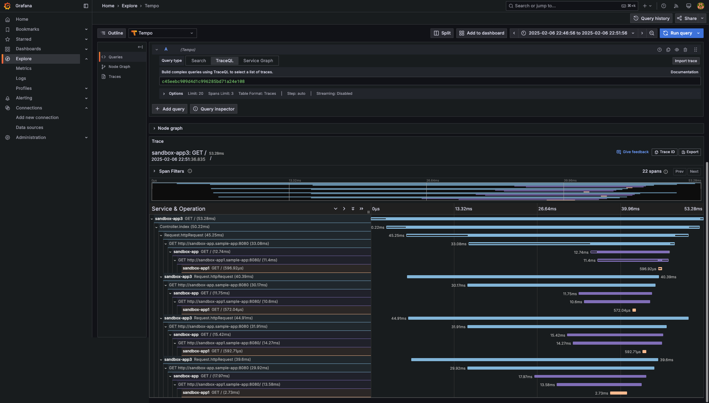
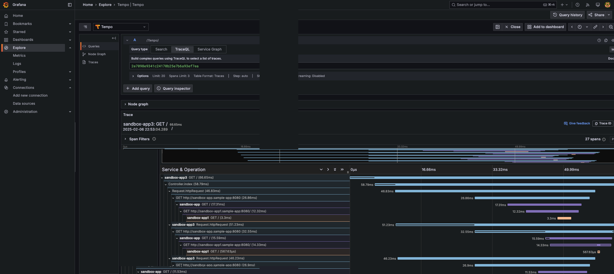
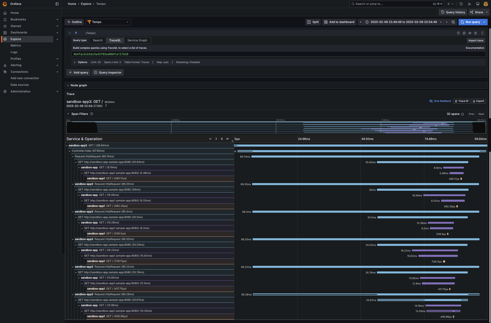
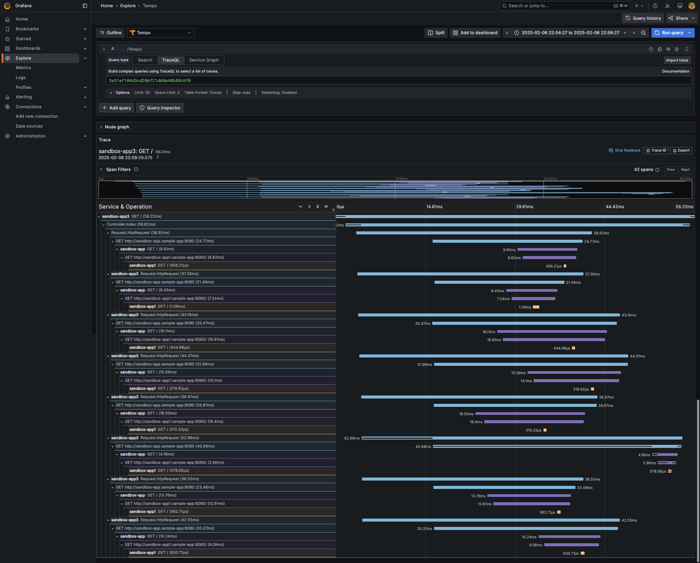
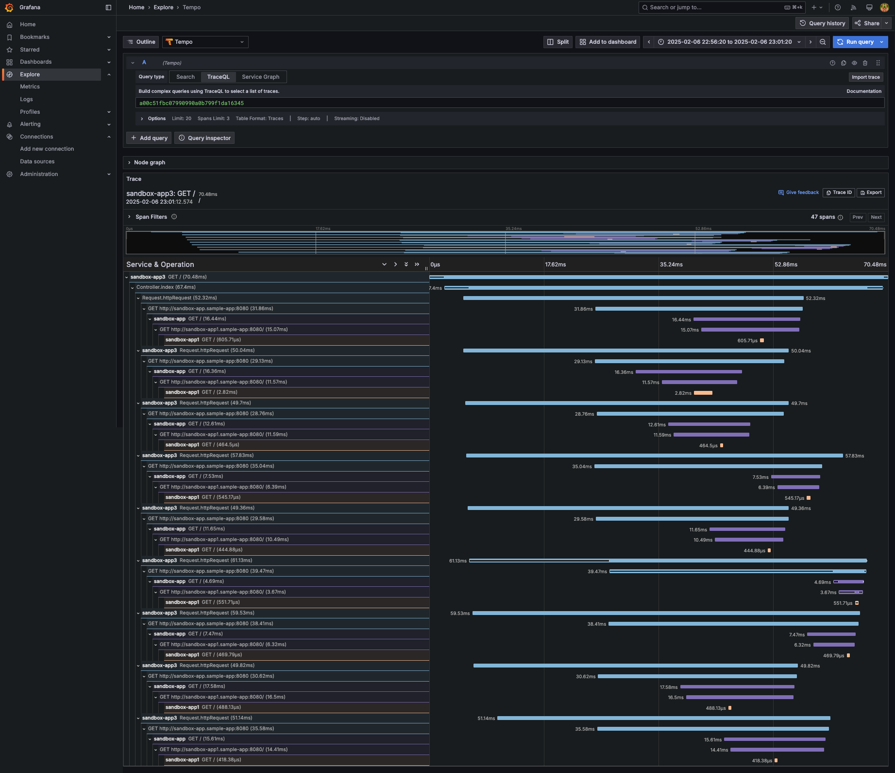
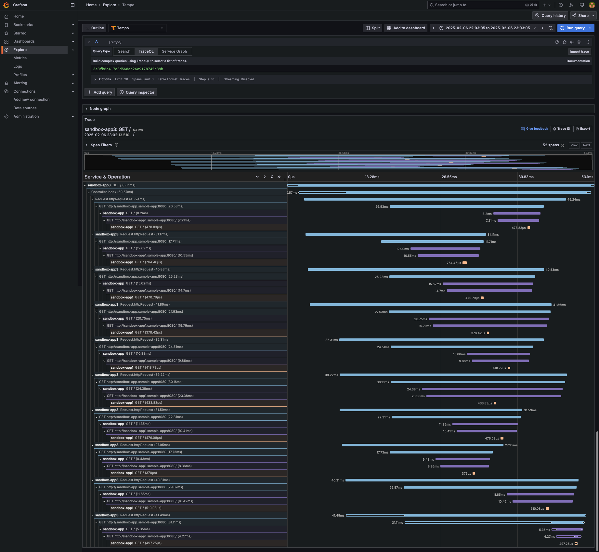
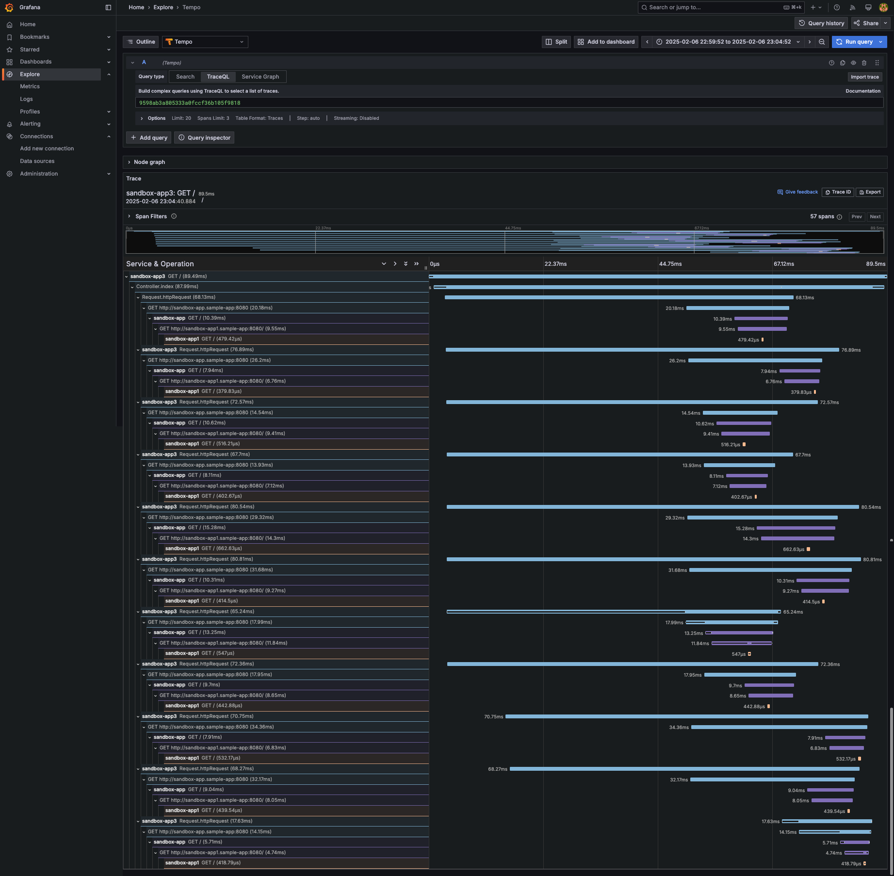
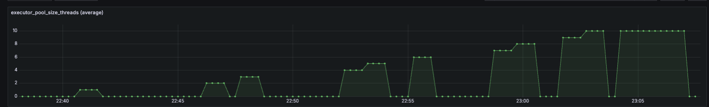

# Thread Pool Task Executor Sandbox

## Intro

This repository summarizes the concept for parameters necessary for parallel processing using `ThreadPoolTaskExecutor`.

## architecture

```:
TBU
```

## Description of each parameter

***maxPoolSize***

TBU

***corePoolSize***

TBU

***queueCapacity***

TBU

## Verification of each parameter(For a single request)

### maxPoolSize

In this case, we will check the behavior when `maxPoolSize` is set to 10.

Initial metrics are pasted below.


***maxPoolSize:1***

sample curl

```:bash
root@sandbox-app2-784969bc79-49xjg:/# curl http://sandbox-app3.sample-app:8080 -H test-app:1
```

apm


***maxPoolSize:2***

sample curl

```:bash
root@sandbox-app2-784969bc79-49xjg:/# curl http://sandbox-app3.sample-app:8080 -H test-app:2
```

apm


***maxPoolSize:3***

sample curl

```:bash
root@sandbox-app2-784969bc79-49xjg:/# curl http://sandbox-app3.sample-app:8080 -H test-app:3
```

apm


***maxPoolSize:4***

sample curl

```:bash
root@sandbox-app2-784969bc79-49xjg:/# curl http://sandbox-app3.sample-app:8080 -H test-app:4
```

apm



***maxPoolSize:5***

sample curl

```:bash
root@sandbox-app2-784969bc79-49xjg:/# curl http://sandbox-app3.sample-app:8080 -H test-app:5
```

apm



***maxPoolSize:6***

sample curl

```:bash
root@sandbox-app2-784969bc79-49xjg:/# curl http://sandbox-app3.sample-app:8080 -H test-app:6
```

apm



***maxPoolSize:7***

sample curl

```:bash
root@sandbox-app2-784969bc79-49xjg:/# curl http://sandbox-app3.sample-app:8080 -H test-app:7
```

apm


***maxPoolSize:8***

sample curl

```:bash
root@sandbox-app2-784969bc79-49xjg:/# curl http://sandbox-app3.sample-app:8080 -H test-app:8
```

apm



***maxPoolSize:9***

sample curl

```:bash
root@sandbox-app2-784969bc79-49xjg:/# curl http://sandbox-app3.sample-app:8080 -H test-app:9
```

apm



***maxPoolSize:10***

sample curl

```:bash
root@sandbox-app2-784969bc79-49xjg:/# curl http://sandbox-app3.sample-app:8080 -H test-app:10
```

apm



***maxPoolSize:11***

sample curl

```:bash
root@sandbox-app2-784969bc79-49xjg:/# curl http://sandbox-app3.sample-app:8080 -H test-app:11
```

apm



***Summary***

It is often assumed that `maxPoolSize` will throw an error if the number of parallel requests exceeds its value, but this is not the case. Instead, excess tasks are placed in the queue (`queueCapacity`), and an error only occurs if the queue also reaches its limit.

Reference images are shown below.



This image represents the number of threads that can be processed simultaneously, not the number of incoming requests. Even if more than 10 requests arrive, only 10 threads will be executing at the same time, while the remaining requests wait in the queue.

In the case of single request verification, `maxPoolSize` is usually not exceeded. This is because, unless a large number of parallel requests are made, the pool does not need to expand beyond `corePoolSize`, and excess tasks are handled by `queueCapacity`. As a result, `maxPoolSize` may not have a noticeable effect unless a high level of concurrency is tested.

The point to remember is that `maxPoolSize` defines the upper limit of dynamically created threads, but it does not enforce a strict constraint on the number of requests being processed. If you want to impose a strict limit, you need to implement additional controls yourself. By default, an error (RejectedExecutionException) occurs when `queueCapacity` is exceeded, as it determines whether additional tasks can be accepted.

### corePoolSize

TBU

### queueCapacity

TBU
