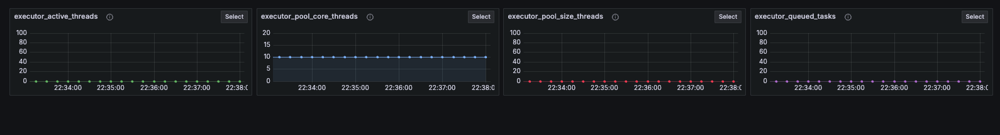
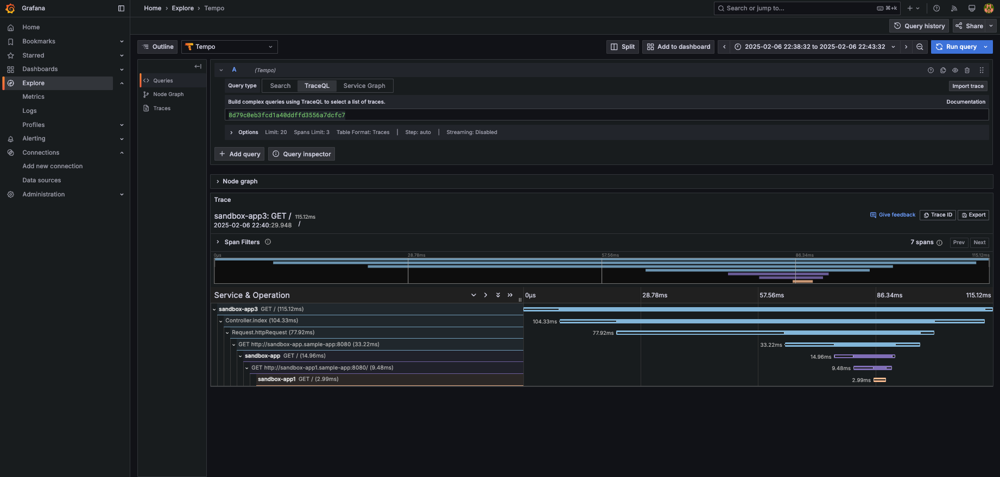
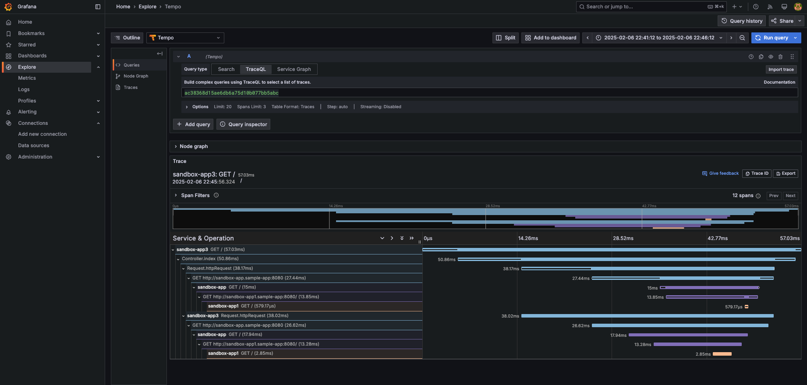
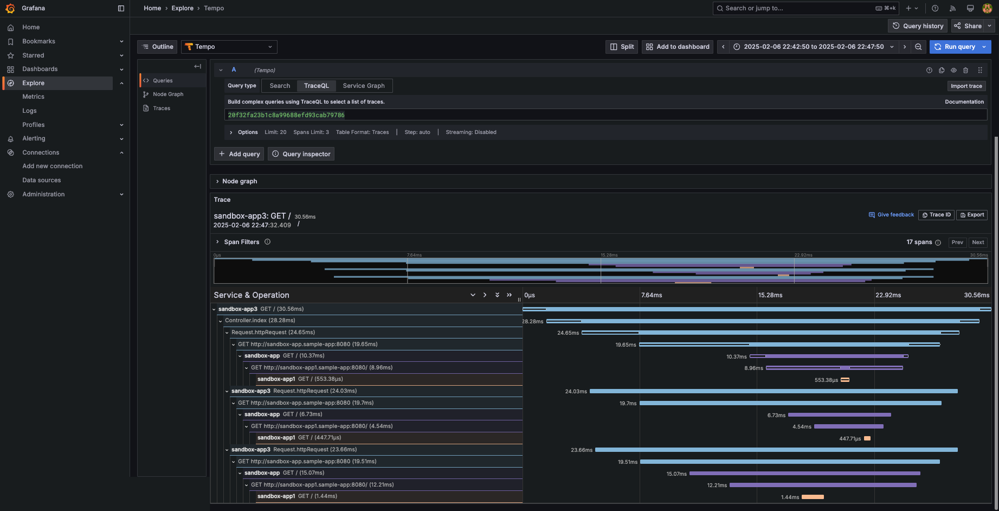

# Thread Pool Task Executor Sandbox

## Intro

This repository summarizes the concept for parameters necessary for parallel processing using `ThreadPoolTaskExecutor`.

## architecture

```:
TBU
```

## Description of each parameter

***maxPoolSize***

TBU

***corePoolSize***

TBU

***queueCapacity***

TBU

## Verification of each parameter

### maxPoolSize

In this case, we will check the behavior when `maxPoolSize` is set to 10.

Initial metrics are pasted below.



***maxPoolSize:1***

sample curl

```:bash
root@sandbox-app2-784969bc79-49xjg:/# curl http://sandbox-app3.sample-app:8080 -H test-app:1
```

apm



***maxPoolSize:2***

sample curl

```:bash
root@sandbox-app2-784969bc79-49xjg:/# curl http://sandbox-app3.sample-app:8080 -H test-app:2
```

apm



***maxPoolSize:3***

sample curl

```:bash
root@sandbox-app2-784969bc79-49xjg:/# curl http://sandbox-app3.sample-app:8080 -H test-app:3
```

apm



***maxPoolSize:4***

sample curl

```:bash
root@sandbox-app2-784969bc79-49xjg:/# curl http://sandbox-app3.sample-app:8080 -H test-app:4
```

apm


***maxPoolSize:5***

sample curl

```:bash
root@sandbox-app2-784969bc79-49xjg:/# curl http://sandbox-app3.sample-app:8080 -H test-app:5
```

apm


***maxPoolSize:6***

sample curl

```:bash
root@sandbox-app2-784969bc79-49xjg:/# curl http://sandbox-app3.sample-app:8080 -H test-app:6
```

apm


***maxPoolSize:7***

sample curl

```:bash
root@sandbox-app2-784969bc79-49xjg:/# curl http://sandbox-app3.sample-app:8080 -H test-app:7
```

apm


***maxPoolSize:8***

sample curl

```:bash
root@sandbox-app2-784969bc79-49xjg:/# curl http://sandbox-app3.sample-app:8080 -H test-app:8
```

apm


***maxPoolSize:9***

sample curl

```:bash
root@sandbox-app2-784969bc79-49xjg:/# curl http://sandbox-app3.sample-app:8080 -H test-app:9
```

apm


***maxPoolSize:10***

sample curl

```:bash
root@sandbox-app2-784969bc79-49xjg:/# curl http://sandbox-app3.sample-app:8080 -H test-app:10
```

apm


### corePoolSize

TBU

### queueCapacity

TBU
