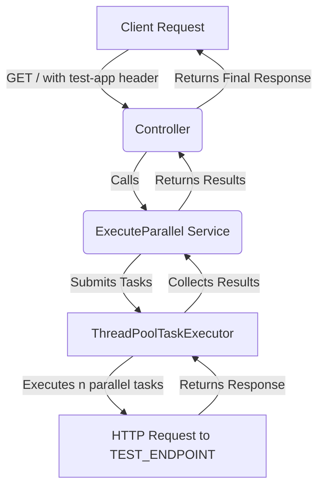

# Thread Pool Task Executor Sandbox

## Intro

This project is a sandbox for experimenting with and understanding the behavior of Spring's `ThreadPoolTaskExecutor`. It allows you to observe how different parameters like `corePoolSize`, `maxPoolSize`, and `queueCapacity` affect task execution and resource utilization under various loads.

## Core Concepts: ThreadPoolTaskExecutor Parameters

The behavior of `ThreadPoolTaskExecutor` is governed by three primary parameters:

- **`corePoolSize`**: The minimum number of threads that are kept alive even if they are idle.
- **`maxPoolSize`**: The maximum number of threads that can be created.
- **`queueCapacity`**: The capacity of the task queue. If all core threads are busy, new tasks are queued.

### Task Execution Logic

1. If the number of active threads is less than `corePoolSize`, a new thread is created.
1. If the number of active threads is equal to `corePoolSize`, the task is added to the queue.
1. If the queue is full and the number of active threads is less than `maxPoolSize`, a new thread is created.
1. If the queue is full and the number of active threads is equal to `maxPoolSize`, the task is rejected (depending on the rejection policy).

## Configuration

You can configure the thread pool using the following environment variables:

| Environment Variable        | Description                                       | Default Value |
| :-------------------------- | :------------------------------------------------ | :------------ |
| `THREADPOOL_CORE_SIZE`      | Initial/Minimum number of threads                 | `3`           |
| `THREADPOOL_MAX_SIZE`       | Maximum number of threads                         | `5`           |
| `THREADPOOL_QUEUE_CAPACITY` | Task queue capacity                               | `10`          |
| `TEST_ENDPOINT`             | The URL for tasks to perform HTTP GET requests to | (Required)    |

## Architecture

The application flow for a single client request is as follows:


```mermaid
graph TD
    A[Client Request] -->|GET / with test-app header| B(Controller)
    B -->|Calls| C(ExecuteParallel Service)
    C -->|Submits Tasks| D[ThreadPoolTaskExecutor]
    D -->|Executes n parallel tasks| E[HTTP Request to TEST_ENDPOINT]
    E -->|Returns Response| D
    D -->|Collects Results| C
    C -->|Returns Results| B
    B -->|Returns Final Response| A
```

- **Parallel Execution:** Trigger a burst of parallel HTTP requests via a REST endpoint.
- **Observability:**
  - **OpenTelemetry:** Instrumented with `@WithSpan` to track task execution.
  - **Prometheus Metrics:** Exposes thread pool metrics (active threads, queue size, etc.) via Actuator.
- **Load Testing:** Includes Locust scenarios for simulating traffic and measuring impact.

## API Usage

### GET `/`

Triggers parallel execution of HTTP tasks.

- **Header:** `test-app` (Required): An integer specifying the number of parallel tasks to spawn.

- **Example:**

  ```bash
  curl -H "test-app: 20" http://localhost:8080/
  ```

  This will attempt to execute 20 parallel HTTP GET requests to the `TEST_ENDPOINT`.

## How to Run

### Prerequisites

- Java 17+
- Maven
- Python 3.x (for Locust load tests)

### Build and Run Application

```bash
# Set required environment variables
export TEST_ENDPOINT="http://example.com"
export THREADPOOL_CORE_SIZE=3
export THREADPOOL_MAX_SIZE=5
export THREADPOOL_QUEUE_CAPACITY=10

# Build and Run

./mvnw clean spring-boot:run
```

### Run Load Tests

```bash
cd loadtest-script/sample1
pip install locust
locust -f scenario.py --host=http://localhost:8080
```

## Monitoring Metrics

You can check the Prometheus metrics at: `http://localhost:8080/actuator/prometheus`

Look for metrics like:

- `executor_active_threads`
- `executor_queued_tasks`
- `executor_pool_size_threads`
